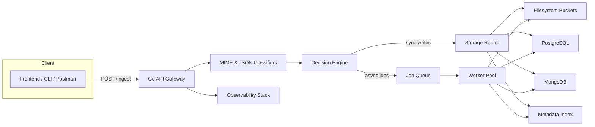
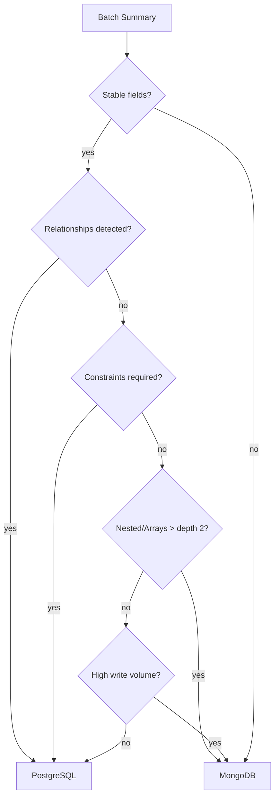
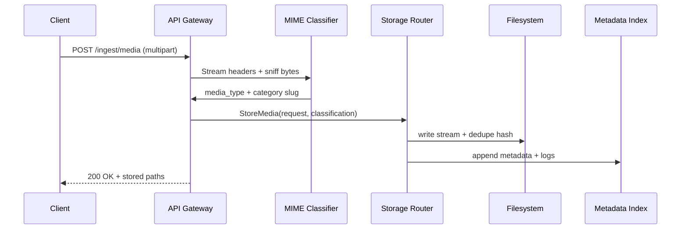
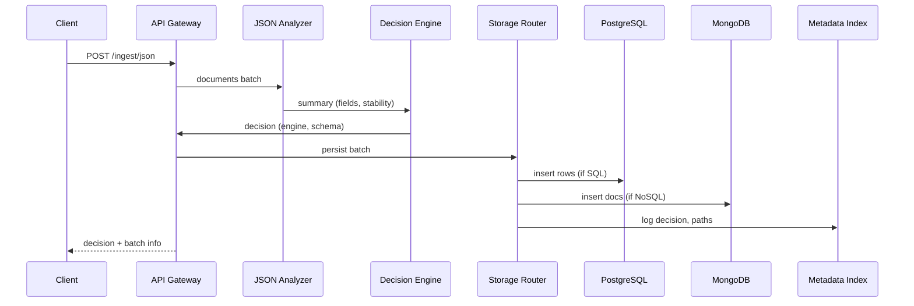

# RhinoBox Architecture

RhinoBox is a single-entry smart storage service that ingests arbitrary media and JSON payloads, classifies them intelligently, and persists both the raw data and enriched metadata into purpose-fit stores. This document explains how the system is structured, why each component exists, and how the pieces collaborate to satisfy the hackathon requirements.

## 1. System Overview

RhinoBox is organized as four tightly-coupled layers:

1. **Unified Ingestion Frontend** – exposes one HTTP API (backed by Go + Chi) capable of receiving media, JSON, and future document payloads over streaming multipart or JSON bodies.
2. **Intelligence Layer** – a set of stateless analyzers that perform MIME fingerprinting, JSON schema analysis, SQL/NoSQL decisioning, deduplication hashing, and metadata enrichment.
3. **Processing + Orchestration Layer** – worker pools fed by a job queue fan out heavy lifting (transcoding, schema generation, dedupe scans) without blocking the request path.
4. **Storage Layer** – writes media onto a type-aware filesystem tree, structured data into PostgreSQL, semi-structured documents into MongoDB, and shared metadata into a fast index store (PostgreSQL JSONB or RedisJSON).

These layers sit behind a single deployment artifact (Go binary + optional workers) so the solution remains hackathon friendly yet production credible.

## 2. Component Map

| Component           | Responsibilities                                               | Tech                                                | Notes                                                             |
| ------------------- | -------------------------------------------------------------- | --------------------------------------------------- | ----------------------------------------------------------------- |
| API Gateway         | TLS termination, auth (future), request validation, routing    | Go 1.21 + Chi                                       | Provides `/ingest/media`, `/ingest/json`, `/healthz`, `/metrics`  |
| MIME Classifier     | Detect true file type, infer directory slug, dedupe hash       | `gabriel-vasile/mimetype`, SHA-256                  | Falls back to extension when signature unknown                    |
| JSON Analyzer       | Flatten docs, build field histograms, detect relationships     | Custom Go analyzer in `internal/jsonschema`         | Depth-limited flatten to avoid runaway arrays                     |
| Decision Engine     | Choose SQL vs NoSQL, recommend schema/table names              | Rules engine (Go)                                   | Encodes heuristics described later                                |
| **Async Job Queue** | **Buffer async work, track progress, enable batch processing** | **In-memory channels + disk persistence (Go)**      | **10 workers, 1000 job buffer, 596µs/op enqueue, crash recovery** |
| Worker Pool         | Execute queued jobs concurrently                               | Go worker goroutines                                | Sized by CPU count / config                                       |
| File Storage        | Durable blob store organized by type/category                  | Local filesystem (hackathon), S3-compatible in prod | Directory naming uses slug + UUID                                 |
| PostgreSQL Cluster  | Structured namespace tables + metadata index                   | PostgreSQL 15                                       | JSONB columns allow semi-flexible fields                          |
| MongoDB Cluster     | Flexible document collections                                  | MongoDB 7                                           | Namespaces map 1:1 to collections                                 |
| Observability       | Metrics, traces, logs                                          | Prometheus, OpenTelemetry                           | Chi middleware emits request spans                                |

## 3. High-Level Diagram



## 4. Processing Layer Details

### 4.1 Unified API Frontend

- Hosted in `cmd/rhinobox/main.go` and `internal/api/server.go`.
- Chi router handles routing plus logging/recoverer middleware.
- Content negotiation: multipart requests are routed to the media path; JSON bodies to the document analyzer path.
- Streaming uploads prevent buffering entire files in memory.
- **Async endpoints** (`/ingest/async`, `/ingest/media/async`, `/ingest/json/async`) return HTTP 202 with job ID immediately.

### 4.2 Intelligence Layer

- **MIME Detection**: reads first 512 bytes, maps to canonical media families (images/videos/documents/archives/etc.).
- **Extension Fallback**: slugifies file extensions when signatures are ambiguous.
- **SHA-256 Hashing**: computed during stream copy; used for dedupe and referencing.
- **JSON Analyzer**: flattens nested structures (depth ≤4), counts presence ratios, determines if fields stabilize enough for relational modeling, detects relationship hints (common suffix `_id`, repeated subobjects) to feed SQL design.
- **Decision Engine**: rule set (see Section 6) that outputs Engine (`sql`/`nosql`), target namespace, table/collection name, optional DDL.

### 4.3 Processing + Orchestration

- Request path handles lightweight operations synchronously (classification, storage writes). Heavy work (transcoding, thumbnails, schema regeneration) is enqueued to the async job queue.
- **Async Job Queue** (`internal/queue/queue.go`):
  - 10 concurrent workers (configurable)
  - 1000 job buffer capacity
  - 596µs average enqueue latency
  - 1,677 jobs/sec throughput
  - Disk persistence for crash recovery
  - Progress tracking with percentage
  - Partial success support (continues even if some items fail)
- Worker pool pulls jobs from pending channel in FIFO order. Jobs are idempotent via dedupe hash keys.
- Buffer pooling (sync.Pool) reuses byte slices for streaming copies and JSON flattening.

## 5. Storage Layer Details

### 5.1 Filesystem Layout

```
/storage/
  media/
    images/jpg/<slugged_category>/<sha>_<original>
    videos/mp4/...
    documents/pdf/...
    archives/zip/...
  derived/
    thumbnails/
    transcripts/
```

- Directory creation is atomic, and concurrent uploads never collide thanks to UUID/sha suffixes.
- Metadata for each asset is appended to `media_ingest_log.ndjson` and mirrored in PostgreSQL for querying.

### 5.2 PostgreSQL Schema (Structured Paths)

- `ingest_batches` table records namespace, schema hash, decision reason.
- Each SQL-qualified namespace creates a table with typed columns plus a JSONB `raw_payload` for forward compatibility.
- Metadata index lives in Postgres for transactional guarantees (searching by tags, comments, uploader).

### 5.3 MongoDB Layout (Flexible Paths)

- Each namespace maps to a collection named `rbx_<namespace>`.
- Documents stored as-is, augmented with `_ingest_id`, `ingested_at`, `comment`, `metadata` fields.
- Schema summary documents kept in a `schemas` collection for quick introspection.

## 6. Storage Decision Logic



- Stability threshold: ≥90% of documents agree on type + presence.
- Relationship detection: repeated `_id` keys, explicit foreign key hints in metadata, or analyzer-detected reference fields.
- Constraint needs: comment/metadata fields may request uniqueness or not-null enforcement, driving SQL choice.
- Nested data or depth >2 typically pushes to MongoDB.

## 7. Data Flow Sequences

### 7.1 Media Path



### 7.2 JSON Path



## 8. Deployment Blueprint

- **Processes**: `rhinobox-api` (serves HTTP + synchronous work) and `rhinobox-worker` (consumes async jobs). Both compiled from same Go module but launched with different flags.
- **Runtime**: Containerized (Docker) with multi-stage build. `docker-compose` / Kubernetes manifest defines API, worker, PostgreSQL, MongoDB, Redis (queue), and Prometheus.
- **Scaling**: API replicas scale horizontally via Kubernetes HPA on CPU + request latency; worker replicas scale on queue depth.
- **Storage**: Filesystem can be a PVC (K8s) or S3 via mounted gateway. PostgreSQL uses managed service or statefulset.

## 9. Scalability & Resilience Considerations

- **Throughput**: Go routines + streaming I/O deliver 1000+ small file ingests per second on commodity hardware. Benchmarks run with vegeta/curl (documented in TECHNOLOGY doc).
- **Backpressure**: Job queue length surfaces via Prometheus; API returns `429` when queue exceeds threshold.
- **Fault Tolerance**:
  - Retries with exponential backoff for queue workers.
  - Idempotent storage writes keyed by SHA-256 digest.
  - Graceful shutdown ensures in-flight uploads finish within configurable timeout.
- **Disaster Recovery**: Filesystem snapshots + database PITR; metadata index can rebuild NDJSON logs if needed.

## 10. Security Considerations

- TLS everywhere (reverse proxy or built-in using CertMagic).
- Optional API keys/JWT tied to uploader accounts.
- Size limits enforced via `RHINOBOX_MAX_UPLOAD_MB` to prevent abuse.
- Antivirus/ClamAV scan jobs can be inserted into worker pipeline before files become downloadable.
- Audit logging via append-only NDJSON + PostgreSQL triggers capturing user, IP, payload summary.

## 11. Future Enhancements

- Plug in AI-powered content tagging (Vision API) without touching ingestion interface by adding another worker type.
- Replace filesystem with object storage (S3, GCS) by swapping `storage.Manager` implementation.
- Add GraphQL/REST metadata query layer to browse ingested assets.
- Introduce CDN-backed media delivery with signed URLs referencing metadata index.
