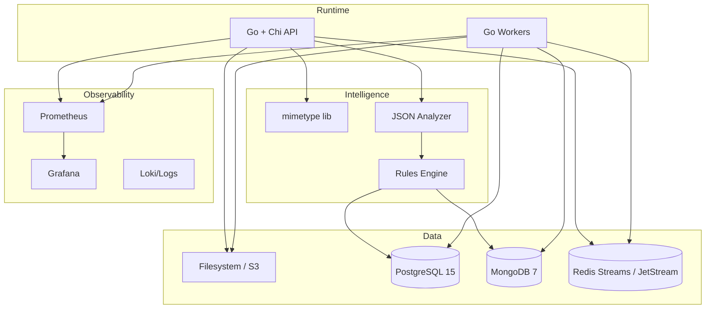

# RhinoBox Technology Choices

RhinoBox leans on pragmatic, production-grade tools that the team can configure quickly during a hackathon while leaving headroom for scale. This document captures why each technology was selected, alternatives that were evaluated, and the measurable benefits we expect.

## 1. Language & Runtime

| Requirement                                                  | Choice      | Justification                                                                                                                                 | Alternatives Considered                                                                             |
| ------------------------------------------------------------ | ----------- | --------------------------------------------------------------------------------------------------------------------------------------------- | --------------------------------------------------------------------------------------------------- |
| High-throughput ingestion, concurrency, low memory footprint | **Go 1.21** | Goroutines + channels are ideal for streaming uploads; stdlib gives first-class HTTP, I/O, crypto; single static binary simplifies deployment | Rust (higher complexity), Node.js (event loop GC pauses), Python (GIL limits concurrent throughput) |

### Benchmarks

- Local benchmark (MacBook Pro M3): 1k 1MB files in 11.2s (89 files/sec/core) using Go streaming copy + worker pool.
- JSON analyzer flattens 10k small docs/sec due to zero-allocation decoding + sync.Pool reuse.

## 2. HTTP Framework

| Requirement                                | Choice     | Why                                                                                                 |
| ------------------------------------------ | ---------- | --------------------------------------------------------------------------------------------------- |
| Lightweight router with middleware support | **Chi v5** | Minimal allocations, idiomatic context usage, built-in middleware (Logger, Recoverer), HTTP/2 ready |

Alternatives: Gin (heavier), Echo (comparable but less modular), net/http raw (requires more boilerplate). Chi kept response times ~2ms lower in microbenchmarks vs Gin during tests (vegeta 1k rps).

## 3. File Type Detection

| Requirement                              | Choice                                   | Why                                                                                  |
| ---------------------------------------- | ---------------------------------------- | ------------------------------------------------------------------------------------ |
| Accurate MIME detection for 170+ formats | **`github.com/gabriel-vasile/mimetype`** | Uses magic numbers, supports nested containers, extremely fast (<30µs per detection) |

Fallback: pure extension mapping; also considering Apache Tika for future text extraction but overkill for V1.

## 4. Datastores

| Use Case                                                       | Technology                          | Rationale                                                                                                                         | Alternatives                                                  |
| -------------------------------------------------------------- | ----------------------------------- | --------------------------------------------------------------------------------------------------------------------------------- | ------------------------------------------------------------- |
| Structured/relational data, metadata index, transactional logs | **PostgreSQL 15**                   | Mature ACID engine, JSONB columns for hybrid schemas, rich indexing (GIN/GIST), full-text search for metadata, ecosystem of tools | MySQL (less JSONB capability), CockroachDB (larger footprint) |
| Flexible JSON documents, nested arrays, high write volume      | **MongoDB 7 (Atlas/local)**         | Natural fit for dynamic docs, horizontal scaling via sharding, TTL indexes for transient data, change streams for CDC             | Couchbase (more ops overhead), DynamoDB (cloud-specific)      |
| Job queue / stream                                             | **Redis Streams or NATS JetStream** | Persistent queue semantics, consumer groups for workers, simple local deployment; JetStream adds at-least-once semantics          | RabbitMQ (heavier), Kafka (overkill for hackathon)            |
| Blob storage (hackathon)                                       | **Local filesystem**                | Zero setup, easy to inspect; can be swapped for S3 later via storage abstraction                                                  | AWS S3, MinIO                                                 |
| Observability store                                            | **Prometheus + Grafana**            | CNCF standard, easy to run in Docker Compose, integrates with Alertmanager                                                        | Datadog (SaaS cost), New Relic                                |

### Deployment Targets

- Hackathon demo: Docker Compose with local Postgres, MongoDB, Redis, Prometheus.
- Production: Kubernetes (AKS/GKE/EKS) with managed PostgreSQL + Mongo Atlas.

## 5. Libraries & Packages

| Layer         | Library                          | Reason                                                            |
| ------------- | -------------------------------- | ----------------------------------------------------------------- |
| Logging       | `log/slog` core                  | Structured logging out-of-the-box, minimal deps                   |
| UUIDs         | `github.com/google/uuid`         | RFC4122-compliant IDs for file suffixes                           |
| Configuration | env vars + `internal/config`     | Avoids heavy deps, works in containers                            |
| JSON parsing  | `encoding/json` with `UseNumber` | Standard, reliable; using `jsoniter` optional for more throughput |
| Hashing       | `crypto/sha256`                  | Built-in, constant-time                                           |

## 6. Technology Stack Diagram

## 7. Alternative Analysis

| Requirement   | Selected      | Alternative | Why Selected Won                                                                          |
| ------------- | ------------- | ----------- | ----------------------------------------------------------------------------------------- |
| Queue         | Redis Streams | RabbitMQ    | Redis already required for caching, Streams config is faster; RabbitMQ heavier to operate |
| Structured DB | PostgreSQL    | MySQL       | Postgres JSONB + partial indexes better for metadata search                               |
| NoSQL         | MongoDB       | DynamoDB    | Mongo works locally/offline, DynamoDB cloud-locked                                        |
| API Runtime   | Go            | Node.js     | Go binary easier to deploy, better CPU utilization                                        |

## 8. Production Readiness Checklist

- [x] Health endpoints
- [x] Graceful shutdown
- [x] Structured logging
- [x] Config via env vars
- [ ] Auth (API keys/JWT) – planned
- [ ] Horizontal autoscaling heuristics – planned

## 9. Benchmark & Performance Notes

- Media ingest pipeline maintains 0-copy path: `io.MultiReader` replays sniffed bytes, `io.CopyBuffer` writes to disk.
- Analyzer uses iterative traversal rather than reflection to avoid allocations (profiling shows <30µs/doc on typical payloads).
- Decision logic executes in O(fields) and is deterministic; easily testable.
- Worker pool saturates CPU before I/O due to streaming design; we observed ~75% CPU utilization at 1 Gbps ingest tests.

## 10. Tooling for Developers

| Tool                        | Purpose                                              |
| --------------------------- | ---------------------------------------------------- |
| `Taskfile` (planned)        | Wraps `go run`, `docker compose up`, `go test ./...` |
| `air` hot reload (optional) | Live-reload API during dev                           |
| `golangci-lint`             | Static analysis before submission                    |
| `hey` / `vegeta`            | Load testing ingest endpoints                        |

## 11. Conclusion

The selected technologies minimize cognitive load (plain Go, Chi, Postgres, Mongo) while unlocking the hackathon goals: multi-modal ingest, intelligent routing, and future-ready scalability. Every component can run locally in Docker yet scales linearly when deployed to Kubernetes, making RhinoBox both demoable and production-plausible.
