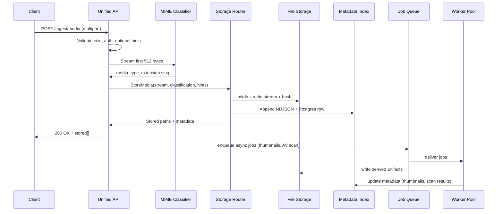
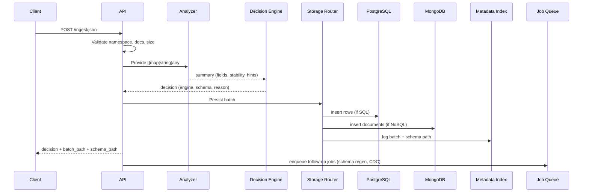
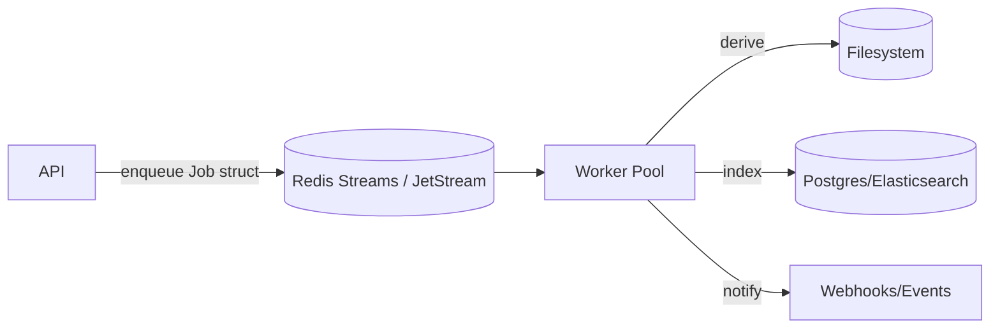

# RhinoBox Workflows

This document details every significant flow that RhinoBox executes today and in the extended design. Each section includes request/response examples, operational notes, and edge-case handling so the system can be demoed or extended quickly.

## 1. API Surface Summary

| Endpoint                  | Method                   | Purpose                                | Synchronous Work                                                         | Async Work                                         |
| ------------------------- | ------------------------ | -------------------------------------- | ------------------------------------------------------------------------ | -------------------------------------------------- | --- |
| `/healthz`                | GET                      | Liveness/readiness probe               | Return status/time                                                       | —                                                  |
| `/ingest/media`           | POST multipart/form-data | Upload any file(s) with optional hints | MIME detection, dedupe hash, filesystem write, metadata log              | Thumbnailing, AV scanning, transcript extraction   |
| `/ingest/json`            | POST application/json    | Upload structured JSON batch           | Batch validation, schema analysis, SQL/NoSQL decision, batch persistence | Schema regeneration, index rebuild, downstream CDC |
| `/ingest/media/preview`\* | POST                     | dry-run classification without storing | MIME detection                                                           | —                                                  |
| `/ingest/json/preview`\*  | POST                     | dry-run schema decision                | Analyzer + decision                                                      | —                                                  |
| `/catalog/media`\*        | GET                      | Browse categorized assets              | Metadata query                                                           | —                                                  |
| `/catalog/json`\*         | GET                      | List namespaces & schemas              | Metadata query                                                           | —                                                  |
| `/logs/{media             | json}`\*                 | GET                                    | Stream NDJSON logs                                                       | Read log files                                     | —   |
| `/metrics`                | GET                      | Prometheus metrics                     | render counters/histograms                                               | —                                                  |

\*Planned endpoints documented for hackathon completeness.

## 2. Media/File Ingestion Workflow (V1)

### 2.1 Sequence



### 2.2 Detailed Steps

1. **Client Upload** – uses multipart/form-data with `file` fields (multiple allowed) plus optional `category` and `comment`.
2. **Unified API** – enforces `RHINOBOX_MAX_UPLOAD_MB`, streams file content to avoid buffering.
3. **MIME Detection** – reads 512 bytes, maps to canonical type (image/video/audio/document/archive/spreadsheet/other). If signature unknown, extension decides.
4. **Directory Routing** – builds path `/storage/media/<type>/<subtype>/<category>/sha_uuid_original.ext` replicating the example tree from the issue.
5. **Metadata Extraction** – collects MIME, sha256, size, uploader, classification, category, comment, ingestion timestamp.
6. **Storage** – writes the stream and logs metadata to NDJSON + PostgreSQL `media_assets` table.
7. **Response** – returns `{stored:[...records...]}` to the client including relative paths.
8. **Async Processing** – optional pipeline includes: thumbnailing (images), keyframe extraction (videos), OCR (PDF), antivirus scanning, dedupe enforcement, CDN push.

### 2.3 Directory Structure (Expanded)

```
/storage/media/
  images/
    jpg/
    png/
    gif/
  videos/
    mp4/
    avi/
    mov/
  documents/
    pdf/
    docx/
    txt/
  spreadsheets/
    xlsx/
    csv/
  archives/
    zip/
    tar/
  audio/
    mp3/
    wav/
  other/
```

### 2.4 Error Handling & Edge Cases

- Files exceeding limit → `413 Payload Too Large` with `max_upload_mb` hint.
- Duplicate uploads → 200 OK but include `duplicate_of` field referencing first ingest ID; dedupe enforced via SHA hash lookup.
- Unsupported MIME → `422 Unprocessable Entity` with allowed types list.
- Partial failure (one file fails) → 207 Multi-Status style JSON (per-file status) or best-effort success with errors list.

## 3. JSON Ingestion Workflow

### 3.1 Sequence



### 3.2 Step Breakdown

1. **Input Validation** – at least one document or `documents` array, namespace slug, optional `comment`, `metadata`. Document count ≤ configurable limit (default 256 per batch).
2. **Analyzer** – flattened view (depth 4), collects metrics: presence %, distinct value counts, nested depth, relationship hints (string IDs linking between docs), and volume heuristics.
3. **Decision Engine** – uses rule block described in ARCHITECTURE doc (Section 6). Returns: `engine`, `reason`, `table`/`collection`, `schema` (DDL for SQL), `summary`.
4. **Storage Router** – composes file path `data/json/<engine>/<namespace>/batch_<timestamp>.ndjson`, persists original docs for replay. Then writes to the chosen database:
   - **SQL**: ensures table exists (CREATE TABLE if not), inserts typed rows with `raw_payload` JSONB fallback.
   - **NoSQL**: upserts entire docs with metadata envelope.
5. **Schema Artifacts** – for SQL decisions, writes `schema.json` containing DDL, stability metrics, decision rationale.
6. **Response** – includes decision object, batch path, schema path, counts.
7. **Async Jobs** – optional tasks: query plan analysis, materialized view build, data sampling for dashboards.

### 3.3 Error Handling

- Invalid JSON → `400` with message from decoder.
- Namespace missing or invalid slug → `400`.
- Analyzer fail (too deep/large) → `413` with guidance to split batches.
- Database write failure → `500` + trace ID; ingestion log stores failure reason for replay.
- Partial success (some docs fail) → best-effort with `failed_documents` array; also pushes to retry queue.

### 3.4 Edge Cases & Hints

- **Metadata-driven overrides**: clients can send `{ "metadata": { "force_engine": "sql" } }`; system logs override reason.
- **Relationships**: analyzer inspects `*_id` patterns to propose join relationships; documented in schema summary.
- **Versioning**: new schema versions create new tables `namespace_v2` or new Mongo collections; metadata index tracks active version.

## 4. Worker & Queue Workflow



- Jobs include type (`thumbnail`, `schema_refresh`, `cdc_export`), payload reference (paths, namespace), attempt counter, and dedupe key.
- Workers acknowledge jobs only after success; failures increment `attempts` and requeue with exponential backoff.
- Metrics record queue depth, processing latency, failure rates for hackathon judges.

## 5. Request & Response Examples

### 5.1 Media Success

```json
{
  "stored": [
    {
      "path": "media/images/jpg/wildlife/sha1234_tiger.jpg",
      "mime_type": "image/jpeg",
      "media_type": "image",
      "category": "wildlife",
      "comment": "demo run",
      "hash": "sha256:3b7...",
      "uploaded_at": "2025-11-15T18:42:00Z"
    }
  ],
  "async_jobs": [{ "id": "job_abc", "type": "thumbnail" }]
}
```

### 5.2 JSON Decision

```json
{
  "decision": {
    "engine": "sql",
    "table": "inventory_v1",
    "schema": "CREATE TABLE inventory_v1 (...)",
    "reason": "Stable fields with relationships sku_id -> supplier_id",
    "summary": {
      "documents": 128,
      "fields": 14,
      "stability_score": 0.94
    }
  },
  "batch_path": "json/sql/inventory/batch_20251115T184500.ndjson",
  "schema_path": "json/sql/inventory/schema.json",
  "documents": 128
}
```

### 5.3 Error Sample

```json
{
  "error": "payload exceeds configured limit",
  "max_upload_mb": 512,
  "trace_id": "rbx-7f2c"
}
```

## 6. Operational Flows

### 6.1 Observability

- `/metrics` exposes counters: `rbx_media_ingests_total`, `rbx_json_batches_total`, histograms for duration, queue depth gauges, dedupe hit ratio.
- `/logs/*` streaming endpoints support tailing ingest logs for debugging.
- Alerts: queue depth > threshold, worker failure rate >5%, disk usage >80%.

### 6.2 Disaster Recovery Flow

1. Restore filesystem snapshot or S3 bucket version.
2. Restore PostgreSQL + MongoDB from PITR/backups.
3. Rebuild metadata index by replaying NDJSON logs if necessary.
4. Resume workers; API automatically resumes job dispatch.

### 6.3 Security Workflow

- API keys/JWT validated before ingestion.
- Upload scanning job ensures quarantined files never become publicly accessible until clean.
- Audit entries stored for every request with user ID, IP, payload summary.

## 7. Edge Feature Concepts (Future)

- **Webhook notifications**: `POST /webhooks/event` configured per namespace; worker sends event when batch completes.
- **Data retention policies**: scheduled job purges old assets, updates metadata index accordingly.
- **Self-service schema explorer**: GraphQL endpoint reading metadata index to power UI.
