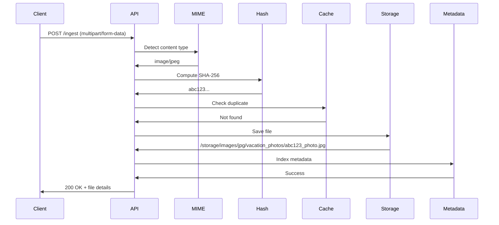
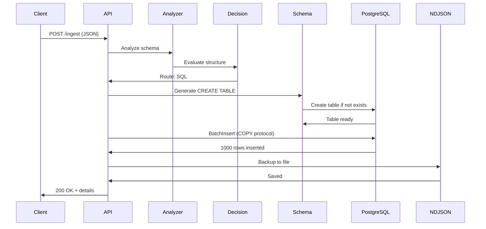
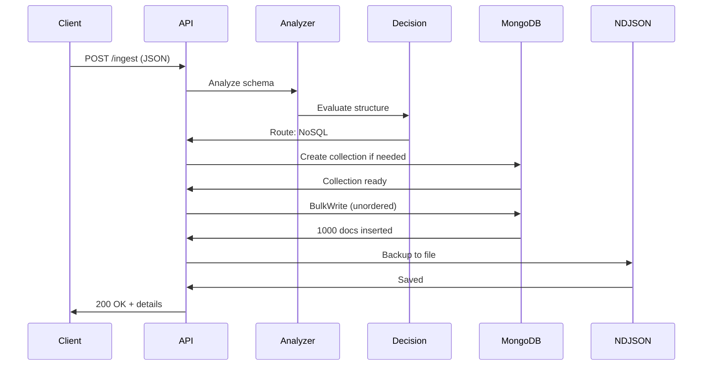
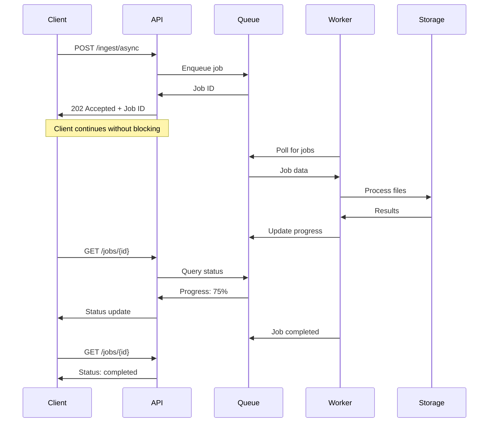
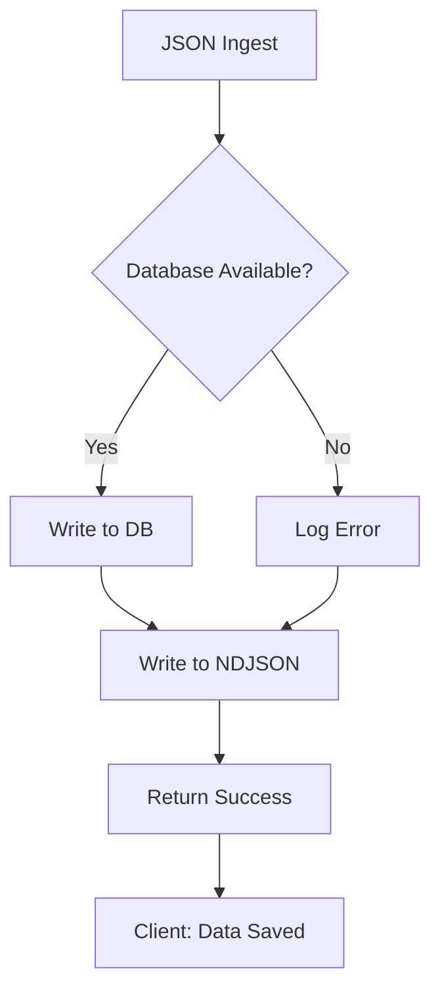
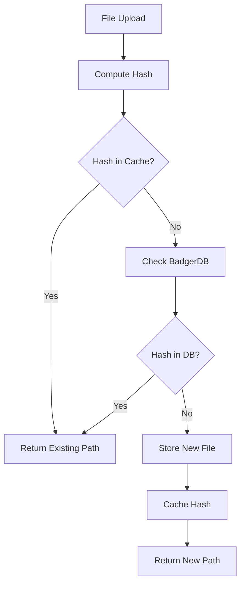
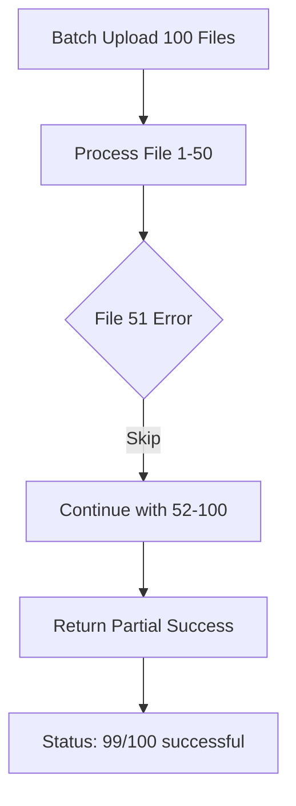

# Data Flow Workflows

This document describes the step-by-step workflows for different data types in RhinoBox, including request/response examples, timing breakdowns, and error handling.

## Overview

RhinoBox provides a unified `/ingest` endpoint that intelligently routes different data types through optimized processing pipelines:

- **Media/File Pipeline**: Images, videos, audio, documents → Type-based organization
- **JSON Pipeline**: Structured data → SQL (PostgreSQL) or NoSQL (MongoDB) based on schema analysis
- **Async Pipeline**: Background processing for batch operations

---

## 1. Media Upload Workflow

### Flow Diagram



### Step-by-Step Process

1. **Request Reception** (1-2ms)

   - Client uploads file via multipart form
   - Server validates request size and format
   - Extracts file, category hint, and comment

2. **MIME Detection** (1-3ms)

   - Reads first 512 bytes (magic numbers)
   - Detects true MIME type (e.g., `image/jpeg`)
   - Falls back to extension if signature unknown
   - Classifies to category: `images/jpg`

3. **Content Hashing** (5-125ms depending on file size)

   - Computes SHA-256 hash while reading file
   - Hash: `abc123def456...` (64 chars)
   - Used for deduplication and file naming

4. **Duplicate Check** (0.2-12ms)

   - L1 Cache (LRU): 231.5 ns/op
   - L2 Cache (Bloom filter): Fast negative lookup
   - L3 Cache (BadgerDB): 15µs/op
   - If duplicate found: Return existing file path

5. **File Storage** (10-50ms)

   - Directory structure: `/storage/images/jpg/vacation_photos/`
   - Filename: `{hash}_{original}.jpg`
   - Atomic write with temp file → rename
   - Set file permissions: 0644

6. **Metadata Indexing** (2-5ms)

   - Append to `ingest_log.ndjson`
   - Store in cache for quick retrieval
   - Track: hash, path, size, MIME, timestamp

7. **Response** (1ms)
   - Return file details: path, hash, size, category
   - Total latency: **20-200ms** (depending on file size)

### Request Example

```bash
curl -X POST http://localhost:8090/ingest \
  -F "files=@vacation_photo.jpg" \
  -F "category=vacation_photos" \
  -F "comment=Beach sunset, July 2025"
```

### Response Example

```json
{
  "status": "completed",
  "results": {
    "media": [
      {
        "original_name": "vacation_photo.jpg",
        "stored_path": "storage/media/images/jpg/vacation_photos/abc123def456_vacation_photo.jpg",
        "hash": "abc123def456789abcdef0123456789abcdef0123456789abcdef0123456789ab",
        "size": 2457600,
        "mime_type": "image/jpeg",
        "category": "images/jpg/vacation_photos",
        "uploaded_at": "2025-11-15T10:30:00Z",
        "is_duplicate": false
      }
    ]
  }
}
```

### Error Scenarios

| Error            | Status Code | Response                                | Action                  |
| ---------------- | ----------- | --------------------------------------- | ----------------------- |
| No file provided | 400         | `{"error": "no files in request"}`      | Include `files` field   |
| File too large   | 413         | `{"error": "file exceeds size limit"}`  | Reduce file size        |
| Unsupported type | 400         | `{"error": "unsupported file type"}`    | Check MIME type         |
| Storage full     | 507         | `{"error": "insufficient storage"}`     | Free up space           |
| Duplicate upload | 200         | `{"is_duplicate": true, "path": "..."}` | Reference existing file |

---

## 2. JSON Workflow (SQL Route)

### Flow Diagram



### Step-by-Step Process

1. **Request Reception** (1ms)

   - Client sends JSON with `namespace` and `documents`
   - Server parses JSON body
   - Validates structure

2. **Schema Analysis** (5-20ms for 100 docs)

   - Flatten nested objects (depth-limited)
   - Build field histograms: types, frequencies
   - Detect patterns:
     - `*_id` fields → Foreign keys
     - Consistent types → Structured
     - Shallow nesting → Relational

3. **Decision Engine** (1-2ms)

   - **SQL Criteria Met**:
     - Stable schema (>80% consistency)
     - Foreign key patterns detected
     - Shallow nesting (depth ≤ 2)
     - No large arrays
   - Decision: **PostgreSQL**
   - Confidence: 0.95

4. **Schema Generation** (2-5ms)

   - Map field types to SQL:
     - Integer → `BIGINT`
     - Float → `DOUBLE PRECISION`
     - String → `TEXT`
     - Boolean → `BOOLEAN`
     - Timestamp → `TIMESTAMP`
   - Generate `CREATE TABLE` statement
   - Add `raw_payload JSONB` for flexibility

5. **Table Creation** (10-50ms first time, cached after)

   - Execute `CREATE TABLE IF NOT EXISTS`
   - Set up indexes on ID fields
   - Cache table schema (30min TTL)

6. **Batch Insert** (10-100ms for 1000 docs)

   - **COPY Protocol** (for >100 docs):
     - Binary bulk insert
     - 100K+ inserts/sec
     - 10-100x faster than INSERT
   - **Multi-Value INSERT** (for <100 docs):
     - Single query with multiple values
     - Efficient for small batches

7. **NDJSON Backup** (5-20ms)

   - Write to `data/json/sql/{namespace}/batch_{timestamp}.ndjson`
   - Append to audit trail
   - Enables recovery and portability

8. **Response** (1ms)
   - Return namespace, row count, storage location
   - Total latency: **35-300ms** (depending on batch size)

### Request Example

```bash
curl -X POST http://localhost:8090/ingest \
  -H "Content-Type: application/json" \
  -d '{
    "namespace": "orders",
    "comment": "E-commerce orders with customer references",
    "documents": [
      {
        "order_id": 1001,
        "customer_id": 5001,
        "product": "Laptop",
        "quantity": 1,
        "price": 999.99,
        "order_date": "2025-11-15T10:00:00Z",
        "status": "pending"
      },
      {
        "order_id": 1002,
        "customer_id": 5002,
        "product": "Mouse",
        "quantity": 2,
        "price": 29.99,
        "order_date": "2025-11-15T10:05:00Z",
        "status": "shipped"
      }
    ]
  }'
```

### Response Example

```json
{
  "status": "completed",
  "results": {
    "json": {
      "namespace": "orders",
      "engine": "sql",
      "table": "orders",
      "rows_inserted": 2,
      "schema_hash": "sha256:def789...",
      "ndjson_path": "data/json/sql/orders/batch_20251115T103000Z.ndjson",
      "database": "postgresql",
      "confidence": 0.95,
      "decision_reasons": [
        "Stable schema detected (100% consistency)",
        "Foreign key pattern: customer_id",
        "Shallow nesting (depth 1)",
        "Numeric ID fields present"
      ]
    }
  }
}
```

### Generated SQL

```sql
CREATE TABLE IF NOT EXISTS orders (
    order_id BIGINT,
    customer_id BIGINT,
    product TEXT,
    quantity BIGINT,
    price DOUBLE PRECISION,
    order_date TIMESTAMP,
    status TEXT,
    raw_payload JSONB,
    ingested_at TIMESTAMP DEFAULT NOW()
);

CREATE INDEX IF NOT EXISTS idx_orders_customer_id ON orders(customer_id);
```

---

## 3. JSON Workflow (NoSQL Route)

### Flow Diagram



### Step-by-Step Process

1. **Request Reception** (1ms)

   - Same as SQL route

2. **Schema Analysis** (5-20ms)

   - Detect patterns:
     - Inconsistent schemas across docs
     - Deep nesting (depth > 3)
     - Large arrays (>50 elements)
     - Varied field types

3. **Decision Engine** (1-2ms)

   - **NoSQL Criteria Met**:
     - Inconsistent schema (<80% consistency)
     - Deep nesting (depth > 3)
     - Array-heavy structure
     - Comment hints: "flexible", "nosql"
   - Decision: **MongoDB**
   - Confidence: 0.92

4. **Collection Creation** (5-20ms)

   - Create collection: `rhinobox.{namespace}`
   - No schema enforcement (document model)
   - Cached after first creation

5. **Bulk Insert** (5-50ms for 1000 docs)

   - **Unordered BulkWrite**:
     - Parallel execution
     - 200K+ inserts/sec
     - Continues on individual failures
   - Wire compression (snappy/zstd)
   - Augment with metadata:
     - `_ingest_id`: UUID
     - `ingested_at`: Timestamp

6. **NDJSON Backup** (5-20ms)

   - Write to `data/json/nosql/{namespace}/batch_{timestamp}.ndjson`

7. **Response** (1ms)
   - Return namespace, document count, collection name
   - Total latency: **20-120ms**

### Request Example

```bash
curl -X POST http://localhost:8090/ingest \
  -H "Content-Type: application/json" \
  -d '{
    "namespace": "activity_logs",
    "comment": "Flexible event logs, varying structure",
    "documents": [
      {
        "user": {
          "id": "u1001",
          "name": "Alice",
          "metadata": {
            "ip": "192.168.1.10",
            "user_agent": "Chrome/119.0"
          }
        },
        "events": [
          {
            "type": "click",
            "target": "button#submit",
            "timestamp": "2025-11-15T10:00:00Z"
          },
          {
            "type": "scroll",
            "position": 1250,
            "timestamp": "2025-11-15T10:00:05Z"
          }
        ],
        "session_id": "sess_abc123"
      },
      {
        "user": {
          "id": "u1002"
        },
        "events": [
          {
            "type": "page_view",
            "url": "/products",
            "timestamp": "2025-11-15T10:01:00Z",
            "referrer": "https://google.com"
          }
        ]
      }
    ]
  }'
```

### Response Example

```json
{
  "status": "completed",
  "results": {
    "json": {
      "namespace": "activity_logs",
      "engine": "nosql",
      "collection": "activity_logs",
      "documents_inserted": 2,
      "schema_hash": "sha256:ghi012...",
      "ndjson_path": "data/json/nosql/activity_logs/batch_20251115T100200Z.ndjson",
      "database": "mongodb",
      "confidence": 0.92,
      "decision_reasons": [
        "Inconsistent schema (50% consistency)",
        "Deep nesting detected (depth 4)",
        "Array-heavy structure",
        "Comment hint: 'flexible'"
      ]
    }
  }
}
```

---

## 4. Async Job Workflow

### Flow Diagram



### Step-by-Step Process

1. **Job Submission** (0.5-1ms)

   - Client sends data to `/ingest/async`
   - Server validates request
   - Generates UUID job ID

2. **Queue Enqueue** (596µs average)

   - Add job to in-memory channel (capacity: 1000)
   - Persist to disk for crash recovery
   - Return job ID immediately

3. **Immediate Response** (0.5ms)

   - Status: `202 Accepted`
   - Job ID: `job_abc123...`
   - **Zero client blocking**
   - Client can close connection

4. **Background Processing** (varies)

   - 10 concurrent workers poll queue
   - Process files/JSON in parallel
   - Update progress: 0% → 25% → 50% → 75% → 100%

5. **Progress Tracking**

   - Client polls: `GET /jobs/{id}`
   - Real-time status updates
   - Partial results available

6. **Job Completion**
   - Final results stored
   - Status: `completed` or `failed`
   - Results include all file details

### Request Example

```bash
# Submit async job
curl -X POST http://localhost:8090/ingest/async \
  -F "files=@large_video.mp4" \
  -F "files=@photo1.jpg" \
  -F "files=@photo2.jpg" \
  -F "comment=Vacation media batch"
```

### Response Example

```json
{
  "job_id": "job_abc123def456",
  "status": "pending",
  "submitted_at": "2025-11-15T10:00:00Z",
  "total_items": 3,
  "progress": 0
}
```

### Status Check

```bash
# Check job status
curl http://localhost:8090/jobs/job_abc123def456
```

```json
{
  "job_id": "job_abc123def456",
  "status": "processing",
  "submitted_at": "2025-11-15T10:00:00Z",
  "started_at": "2025-11-15T10:00:01Z",
  "total_items": 3,
  "processed_items": 2,
  "progress": 66,
  "results": {
    "media": [
      {
        "original_name": "photo1.jpg",
        "stored_path": "storage/media/images/jpg/photo1.jpg",
        "status": "completed"
      },
      {
        "original_name": "photo2.jpg",
        "stored_path": "storage/media/images/jpg/photo2.jpg",
        "status": "completed"
      }
    ]
  },
  "current_operation": "Processing large_video.mp4"
}
```

### Completed Job

```json
{
  "job_id": "job_abc123def456",
  "status": "completed",
  "submitted_at": "2025-11-15T10:00:00Z",
  "started_at": "2025-11-15T10:00:01Z",
  "completed_at": "2025-11-15T10:02:30Z",
  "duration_seconds": 149,
  "total_items": 3,
  "processed_items": 3,
  "progress": 100,
  "results": {
    "media": [
      {
        "original_name": "large_video.mp4",
        "stored_path": "storage/media/videos/mp4/large_video.mp4",
        "hash": "xyz789...",
        "size": 157286400,
        "status": "completed"
      },
      {
        "original_name": "photo1.jpg",
        "stored_path": "storage/media/images/jpg/photo1.jpg",
        "hash": "abc123...",
        "size": 2457600,
        "status": "completed"
      },
      {
        "original_name": "photo2.jpg",
        "stored_path": "storage/media/images/jpg/photo2.jpg",
        "hash": "def456...",
        "size": 3145728,
        "status": "completed"
      }
    ]
  }
}
```

---

## 5. Error Handling Workflows

### Connection Failure (Database)



**Behavior**:

- Database write attempted first
- On failure: Log error, continue
- NDJSON backup always written
- **Zero data loss** - graceful degradation

### Duplicate Detection



**Behavior**:

- Multi-level deduplication check
- Return existing file if duplicate
- Client gets same response format
- `is_duplicate: true` flag set

### Partial Batch Failure



**Behavior**:

- Individual file failures don't stop batch
- Partial results returned
- Failed items listed with error details
- Client can retry failed items

---

## 6. Performance Metrics

### Latency Breakdown

| Operation                 | P50   | P95   | P99   |
| ------------------------- | ----- | ----- | ----- |
| Media upload (1MB)        | 45ms  | 120ms | 250ms |
| JSON → SQL (100 docs)     | 35ms  | 80ms  | 150ms |
| JSON → MongoDB (100 docs) | 25ms  | 60ms  | 120ms |
| Duplicate check           | 0.5ms | 5ms   | 12ms  |
| Async job enqueue         | 0.6ms | 1.2ms | 2.5ms |

### Throughput

| Operation                   | Throughput      |
| --------------------------- | --------------- |
| File processing             | 1000+ files/sec |
| PostgreSQL inserts (COPY)   | 100K+/sec       |
| MongoDB inserts (BulkWrite) | 200K+/sec       |
| Cache operations            | 3.6M ops/sec    |
| Job queue processing        | 1677 jobs/sec   |

### Resource Utilization

| Resource | Idle    | Under Load |
| -------- | ------- | ---------- |
| CPU      | 2-5%    | 70-80%     |
| Memory   | 50MB    | 200-500MB  |
| Disk I/O | <1MB/s  | 2GB/s+     |
| Network  | <10KB/s | 100MB/s+   |

---

## 7. Edge Cases

### Large File Handling

- **Streaming**: Files processed in chunks (no full load in memory)
- **Zero-copy I/O**: Direct disk writes
- **Backpressure**: Rate limiting prevents memory exhaustion
- **Timeouts**: Configurable per-request timeouts

### Schema Evolution

- **SQL**: Alter table on schema changes (new columns added)
- **NoSQL**: Native flexibility, no migration needed
- **Version tracking**: Schema hash changes tracked
- **Backward compatible**: Old data remains queryable

### Concurrent Uploads

- **Thread-safe**: Atomic file operations
- **No collisions**: UUID/hash-based naming
- **Lock-free**: Lock-free data structures in queue
- **Horizontal scaling**: Stateless workers

---

## Summary

RhinoBox workflows are optimized for:

✅ **Low latency**: <50ms P50 for most operations  
✅ **High throughput**: 1000+ files/sec, 100K-200K DB inserts/sec  
✅ **Zero data loss**: Dual storage (DB + NDJSON backup)  
✅ **Graceful degradation**: Continues on partial failures  
✅ **Async support**: Background processing with progress tracking  
✅ **Smart routing**: Automatic SQL vs NoSQL decision

All workflows include comprehensive error handling, performance optimizations, and production-ready resilience features.
